# resume

> Static, decoupled and easy to maintain!

**Deployed in a [Web version](https://resume.emasuriano.com) and a [PDF version](https://resume.emasuriano.com/index.pdf).**

Please keep the information in sync with linked by using [this tool](https://jmperezperez.com/linkedin-to-json-resume/) ❤️

## Setup

```bash
> git clone  https://github.com/EmaSuriano/gatsby-starter-linkedin-resume.git
> yarn --ignore-engines
> yarn start

```

## Scripts

- `start`: build the project and serve it locally in the [https://localhost:9000](https://localhost:9000).
- `build`: generate public folder to be deployed using [Netlify](http://netflify.com/).
- `generate-resume`: Crawl your data and regenerate your resume.

## How does it work?



Given that accessing the values from LinkedIn is quite restricted, I decided to use an open-source scrapper that will go to your [**Public Profile**](https://www.linkedin.com/in/me), crawl all your information and save it inside the repository.

This project is not saving any of your credentials, they are only being used by the crawler to login inside LinkedIn.

Then the LinkedIn information is going to be map into the [JSONResume Schema](https://jsonresume.org/schema/), which is going to be read to generate your Resume.
